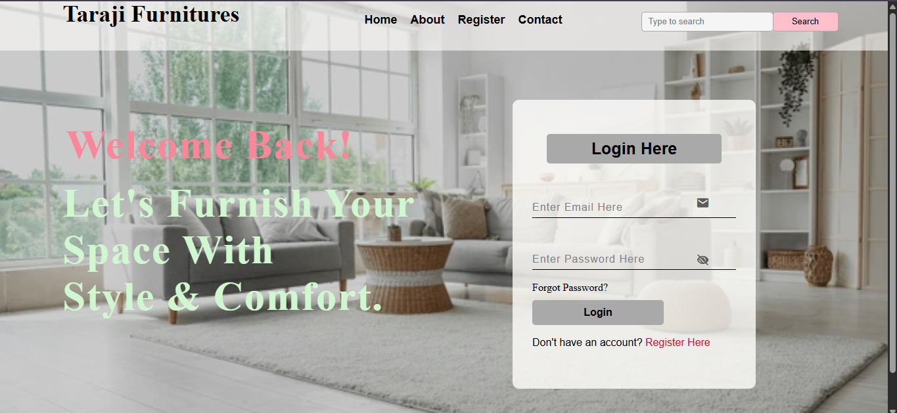
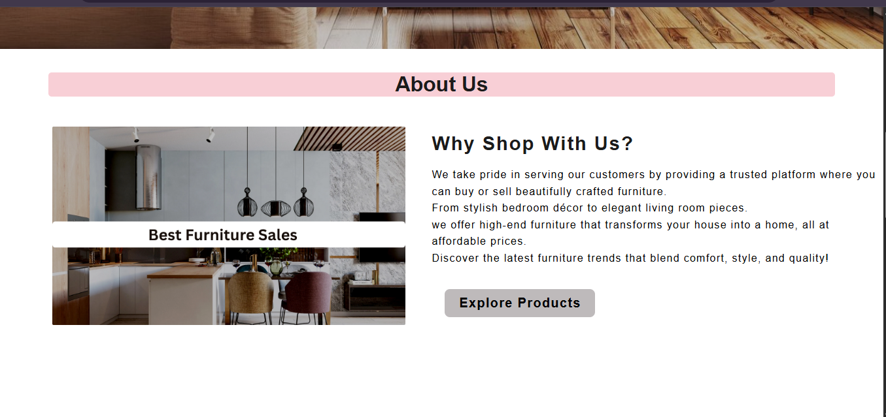
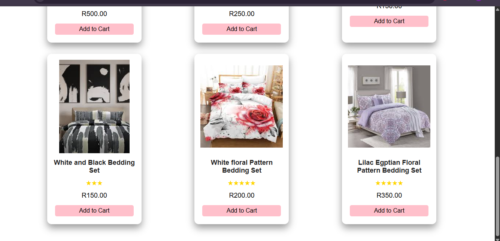
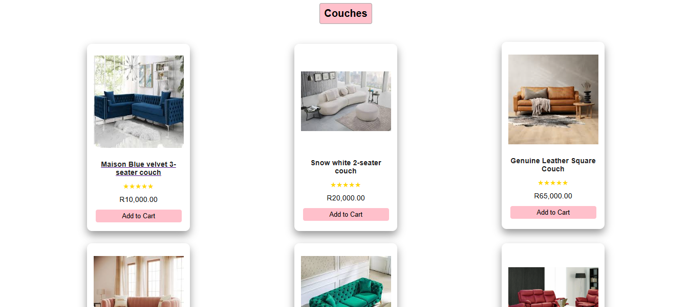
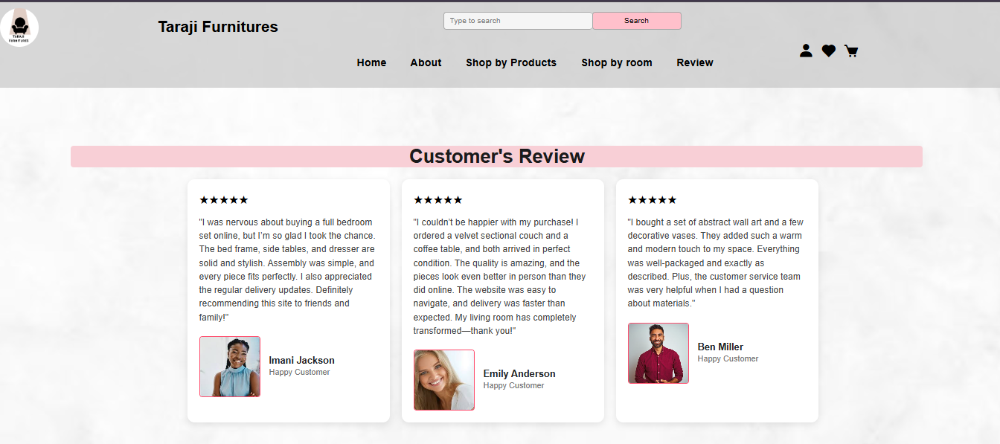
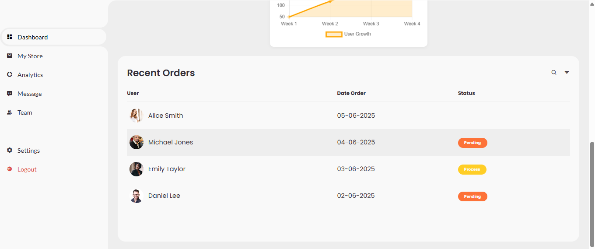
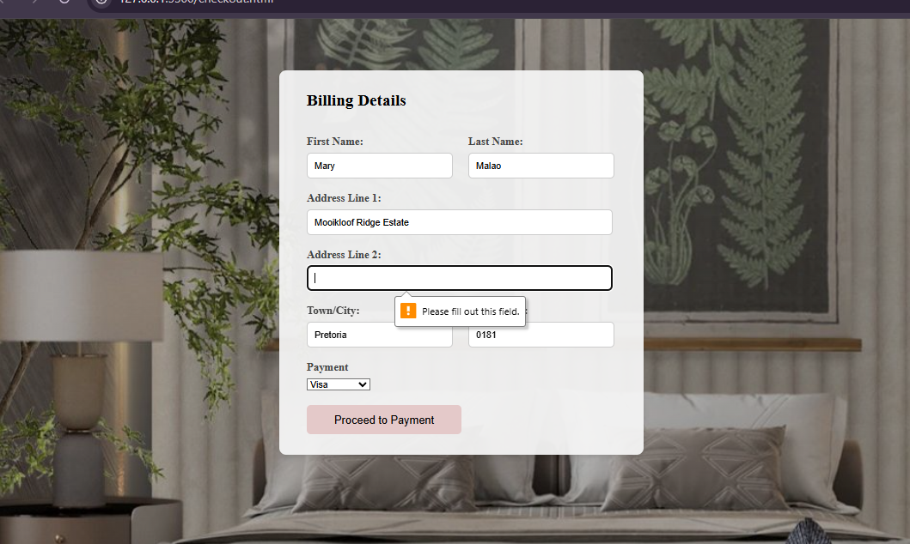
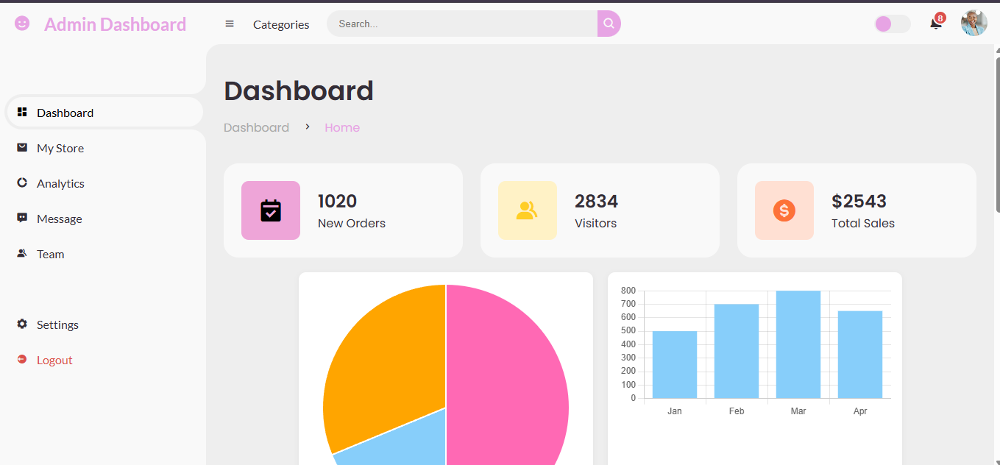

# Furniture-Ecommerce-Website-PHP
Full-stack e-commerce platform for furniture with admin analytics portal. Built with PHP, MySQL, HTML, CSS, and JavaScript.

This is a full-featured e-commerce platform designed for buying and selling furniture online. It provides a seamless shopping experience for customers while giving business owners the tools to manage and analyze their business effectively. Features For Customers: Browse and search a wide range of furniture products. Add products to a shopping cart and place orders. Make secure payments online. For Business Owners/Admins: Access a dedicated portal to manage products, orders, and customers. View detailed business analytics and reports to track sales, revenue, and customer behavior. Technologies Used Frontend: HTML, CSS, JavaScript Backend: PHP Database: MySQL This platform demonstrates a complete web application workflow, from frontend design and user interactions to backend processing and database management.

Setup Instructions (XAMPP)

Install XAMPP (or any PHP & MySQL local server).

Place project folder in htdocs ( C:\xampp\htdocs\website2 ).

Create a MySQL database using phpMyAdmin.

Import the database file from sql/database.sql.

Update database connection in config.php (username, password, database name).

Open browser and go to: http://localhost/website2/

Screenshots are provided below in case you cannot run it locally.

